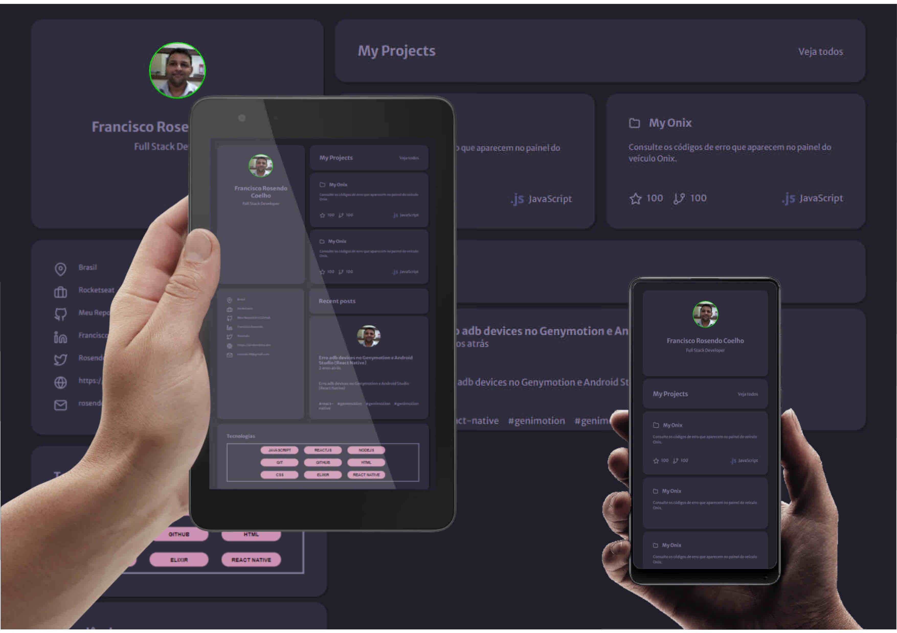

# Desafio do Portfoli da Rocketseat
## (Atualizado com versão mobile)

> Trilha Discover
Projeto construído do primeiro desafio da Rocketseat.
[Clique aqui para acessar.](https://rosendo2015.github.io/DesafioPortfolio)

## Técnicas utilizadas

- Display Grid
- Display Flex
- Unidades de medidas responsivas
- Reponsividade 
- Refatoração

## Tecnologias

- HTML
- CSS
- Git e Github

## Contato
rosendc30@gmail.com
